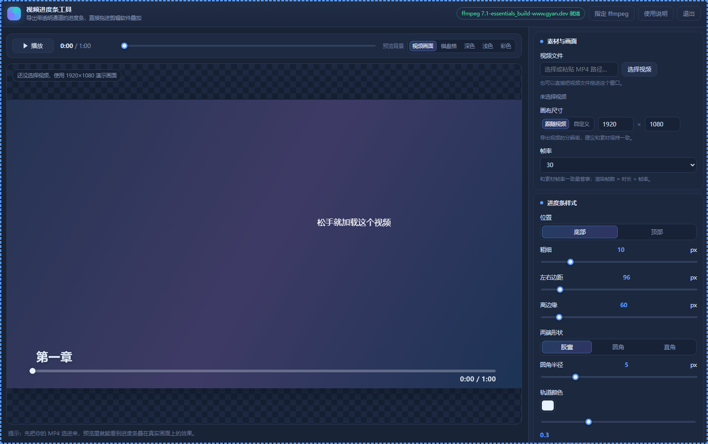

# 视频进度条工具

把一条干净的进度条做成**带透明通道的视频**，拖进剪映 / Pr / 达芬奇，放在素材上面一层就完事。
进度条以外的地方一个像素都没有，**不需要抠像**。



---

## 零、下载与安装

**第一步：下载免安装包。**

**[点这里直接下载（Windows 64 位，63.5 MB）](https://github.com/weilaie/video-progress-bar/releases/latest/download/video-progress-bar-v1.0.0-win64.zip)**

下载下来的文件名是 `video-progress-bar-v1.0.0-win64.zip`。
如果你是从发布页手动下载，注意别拿成 `Source code (zip)`——那个是纯源码，不含运行环境。

**第二步：解压。** 解压到任意文件夹，路径里尽量别带特殊符号。

**第三步：双击文件夹里的 `启动进度条工具.cmd`。** 完事。

**这个包不需要你安装任何东西。** Node.js 运行时和 ffmpeg 都已经打包在里面，
解压即可运行，不写注册表、不装服务、不动系统设置。

如果界面上提示没找到 ffmpeg，点右上角 **指定 ffmpeg** 手动选一个即可——
你装的剪映、Pr、达芬奇目录里通常都自带一份。

> 只想要源代码、自己配环境？点本页右上角绿色 **Code → Download ZIP**，
> 那种方式需要你自己安装 [Node.js](https://nodejs.org)。

本工具完全在本机运行，不联网、不上传任何文件。

---

## 一、怎么打开

双击文件夹里的 **`启动进度条工具.cmd`**。

第一次打开会稍等两三秒，然后弹出一个独立窗口（只有这个工具的窗口，没有地址栏）。

- 会有一个**最小化的黑窗口**，那是工具的后台进程，可以不管它。
- 把工具窗口关掉之后，后台进程大约一分钟内会自己退出，不会一直占着。
- 想立刻关掉，直接关那个黑窗口也可以。

> 如果双击后没有任何反应，改双击 **`调试启动.cmd`**，它会保留一个黑窗口显示详细信息。

---

## 二、怎么用（4 步）

**1. 选素材**
点「素材与画面」里的 **选择视频**，会打开一个素材浏览器：左边选磁盘，中间点文件夹，双击视频文件即可载入。
也可以直接把视频文件**拖进窗口**，或者把路径（例如 `D:\素材\片子.mp4`）粘贴到输入框里回车。

只读取时长、分辨率、帧率，**不会改动你的原文件**。

> 素材浏览器里还有一个「用系统窗口…」，想用 Windows 自带的文件框也行。

**2. 切段落**
在「章节 / 段落」里：

- 填个段数 → 点 **平均分成 N 段**
- 或者填秒数 → 点 **按间隔切分**
- 也可以点 **+ 添加段落** 手工加

列表里 **点标题就能直接改字**，开始时间可以填 `1:23` 或 `83`（秒）两种写法。
「分段视觉」决定段落之间的表现：刻度线 / 分段留白 / 不分段。

标题的显示方式默认是 **全部并排显示**：每个段落的标题从头到尾都摆在自己那段进度条上方，
当前播放到的那一段会亮起来，其他段落自动变淡（这一条可以在下面关掉）。
想换成「一次只显示当前章节」或「章节开头闪现几秒」，在「显示方式」里切换即可。

**3. 调样式**
右边所有改动都会**立刻**显示在左边的预览里——预览里看到的，就是导出的样子。

预览上方可以切换「预览背景」，选 **视频画面** 时会实时抽取你片子里的画面垫在下面，
方便判断进度条压在花哨画面上够不够清楚。

**4. 导出**
在底部「导出」里选格式、保存位置，点 **开始导出**。

---

## 三、导出格式怎么选

| 格式 | 什么时候用 |
| --- | --- |
| **ProRes 4444（.mov，带透明通道）** | **首选**。剪映专业版、Pr、达芬奇都能直接认透明通道，拖上去即可，画质接近无损。 |
| QuickTime PNG（.mov，带透明通道，无损） | 逐像素完美无损，而且比 ProRes 更快，代价是文件略大。 |
| PNG 序列（文件夹） | 万能兜底。任何软件都能导入图片序列，效果和视频一模一样。 |
| MP4 预览版（深色底） | 没有透明通道，用来自己快速确认效果、或者发给别人看。 |
| 纯色底 MOV（便于抠像） | 万一某个软件不认透明通道，用绿色底导出后用「色度抠像」抠掉。 |

**导出位置**默认在视频所在文件夹，文件名默认是 `原文件名_进度条`。

---

## 四、常见问题

**导出要多久？**
大约和「视频时长 × 帧率」成正比。1920×1080、30 帧、1 分钟的视频大约 **30 秒左右**。
如果换成「QuickTime PNG」格式会更快一些。
导出过程中会显示进度和预计剩余时间，随时可以点「取消」。

**画质到底怎么样？**
导出的是近乎无损的画面：与原始画面逐像素比对，最大偏差只有 1/255，肉眼完全看不出来。
颜色按 **bt709 标准**写入文件，剪辑软件读到的颜色和你在这里看到的一致
（早期版本用的是 bt601，放进剪辑软件后颜色会整体偏掉，已经修好了）。

**进度条边缘看起来有点虚？**
那是「进度条样式」里的阴影选项，作用是在花哨画面上让进度条更清楚。
如果你想要绝对锐利的边缘，把它关掉即可。

**导出的视频和我片子的长度对不上？**
导出长度 = 素材时长。如果只想要一小段，先在剪辑软件里剪好素材，再按剪好之后的长度导出；
或者干脆导出整条，在剪辑软件里裁掉多余部分。

**我换了显卡 / 重装了系统，提示找不到 ffmpeg？**
点右上角 **指定 ffmpeg**，选一个 `ffmpeg.exe` 就行（剪映、Pr 等软件目录里通常自己带了一份）。
程序会自动从下面这些地方找：工具自带的 `bin` 目录、系统 PATH、
以及 `C:\ffmpeg\bin`、`C:\Program Files\ffmpeg\bin`、winget 安装目录这类常见位置。
如果它每次都不去找你常用软件里的那一份，可以把路径写进 `config/settings.json`
的 `ffmpegCandidates` 数组（写软件目录或 ffmpeg.exe 都行），这个文件只在你本机，不会被上传。

**杀毒软件会不会误报？**
工具全程在本机运行，不联网、不上传任何东西。免安装包里附带的 Node.js 运行时和
ffmpeg 都是开源软件（见 `THIRD-PARTY-NOTICES.md`），偶尔会被杀软误报，加个信任即可。
如果杀软拦截了「选择文件」弹窗，直接在输入框里粘贴路径也能用。

**点「选择视频」没反应？**
现在点它打开的是工具**自带**的素材浏览器，不依赖 Windows 的文件对话框，一定能弹出来。
如果你之前在旧版本上遇到「点了没反应」，这次已经换掉了。

**进度条的粗细 / 字号和分辨率不匹配？**
换素材时程序会按 1080p 为基准自动换算一次。你自己调过的数值不会被覆盖；
想回到自动值，把画布尺寸切成「跟随视频」即可。

**想改颜色但不知道合不合适？**
把「预览背景」切成「浅色」和「深色」各看一眼，或者选「视频画面」看实际效果。
画面比较花的时候，可以把「背景板」打开，给进度条垫一层半透明底。

---

## 五、目录说明

```
启动进度条工具.cmd      ← 平时双击这个
调试启动.cmd            ← 出问题时双击这个看日志
使用说明.txt            ← 给下载用户的简明说明
app/
  server.js             ← 本地服务（纯 Node 内置模块，无第三方依赖）
  lib/                  ← ffmpeg 定位、媒体探测、导出任务
  public/               ← 界面（HTML / CSS / 渲染引擎）
bin/                    ← 自带的运行时，只有免安装包里有，源码仓库没有
  node.exe              ← Node.js 运行时
  ffmpeg.exe            ← ffmpeg
docs/
  preview.png           ← 界面预览图
  node-missing.txt      ← 万一找不到 Node.js 时显示的提示
tools/
  pick.ps1              ← 系统文件选择框
  selftest.js           ← 后端自检：node tools/selftest.js
  browser-test.js       ← 浏览器端到端自检：node tools/browser-test.js
  bench.js              ← 导出速度 / 画质基准：node tools/bench.js
  probe-check.js        ← 视频信息解析自检：node tools/probe-check.js
config/
  server.log            ← 后台日志
  settings.json         ← 记住 ffmpeg 位置、上次的导出目录、自定义的 ffmpeg 查找路径
```

`app/public/dev-verify.html` 和 `dev-export.html` 是给开发用的自检页面，正常使用用不到。

---

## 六、自检（想确认工具本身没问题时）

```powershell
node tools\selftest.js        # 后端：素材探测 + 五种导出格式 + 透明通道校验
node tools\browser-test.js    # 前端：真实浏览器渲染 40 项像素校验 + 完整导出链路
```
